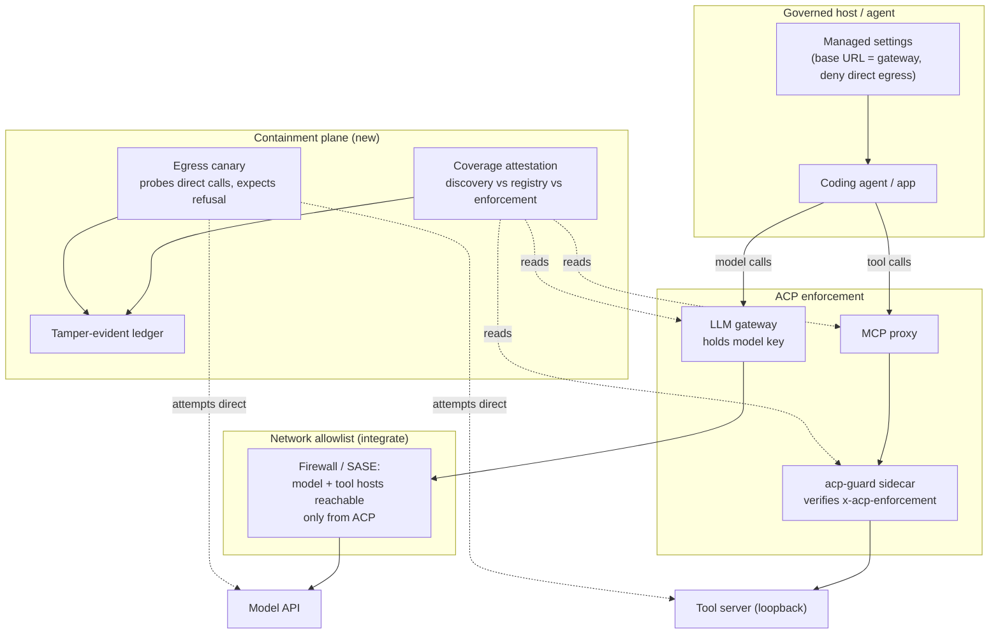
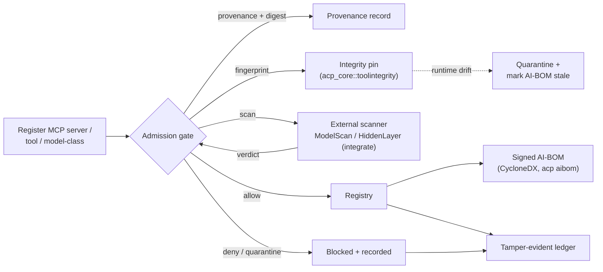
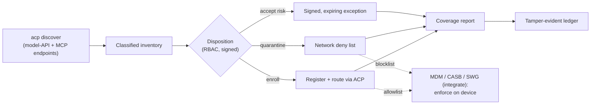

# Gap closure design: making ACP the single product

Date: 2026-09-20
Status: design. Closes the genuine build-gaps named in `docs/gap-analysis.md` section 7.1. Defers to `docs/positioning.md` (the anchor: build the wedge, integrate the rest) and builds on `docs/design/enforcement.md`, `docs/design/p2-operations.md` and `docs/design/entra-setup.md` rather than repeating them.

## 1. Scope and the build-versus-integrate decision

The gap analysis found ACP already covers the five-way intersection no incumbent combines. This document designs the pieces still missing, and is deliberate about which we build and which we integrate. The rule from positioning holds: build only the neutral authorization-and-evidence middle; integrate content, monitoring and lifecycle from the vendors that own them.

| Gap (from gap-analysis 7.1) | Decision | Where designed |
|---|---|---|
| Unavoidability is a deployment property, not a measured posture | Build | Section 2 (containment plane) |
| No model or supply-chain integrity gate; no AI-BOM | Build the gate and the AI-BOM; integrate the scanner | Section 3 |
| Shadow-AI is discovered but not brought under policy | Build the enrollment loop; integrate endpoint reach | Section 4 |
| Real-Entra cutover not demonstrated in production | Ops task, not new design | `docs/design/entra-setup.md` |
| Production HA, DR, shared state | Ops task, already designed | `docs/design/p2-operations.md` |
| Model bias, fairness, drift, explainability monitoring | Integrate | Section 5 |
| Full GRC lifecycle (risk register, impact and conformity assessments) | Integrate | Section 5 |
| Content safety and prompt-injection classifiers | Integrate (already a seam) | Section 5 |
| Connector breadth (IdP, SIEM, ticketing, CASB) | Integrate | Section 5 |

The three build items share one theme: they turn guarantees ACP already has the mechanism for into properties an enterprise can measure, prove and cannot silently lose. That is the difference between "we have a chokepoint" and "we can show you, signed, that nothing got past it".

## 2. The containment plane: unavoidability as a measured posture

Today `enforcement.md` gives an honest guarantee: stdio is structurally unavoidable, HTTP is unavoidable when the deployment puts the enforcement guard in front of the tool server, and the gateway's credential brokering keeps model keys out of the caller's hands. The gap is that "the deployment makes it unavoidable" is asserted, not measured. An enterprise cannot answer, at 3am, "is anything talking to a model or a tool without going through ACP right now?"

The containment plane closes that. It has four parts, three of which reuse existing mechanisms and one of which is new.

### 2.1 Egress lockdown (compose existing pieces)

The only network route to a model API or an HTTP tool server must be through ACP.

- Credential brokering (built, `acp-gateway`): the model key lives only in the gateway. A caller without the key cannot reach the model directly.
- Managed-settings compile (built, `acp-nativecompile`): extend the compiled Copilot, Claude Code and Gemini settings to set the model base URL to the gateway and to deny direct egress destinations, so a coding agent's own config points at ACP and cannot be locally re-pointed where MDM is enforced.
- Network allowlist (integrate): the org's firewall, forward proxy or SASE allows egress to model-API hosts only from the gateway host, and to tool-server hosts only from the proxy or its guard. ACP supplies the allowlist (it knows every governed endpoint); the network enforces it.

Defence in depth: even a leaked model key is useless off-ACP because the network cannot reach the model host except from the gateway.

### 2.2 Mandatory enforcement attestation: ship the guard as `acp-guard`

`enforcement.md` describes an HTTP guard that verifies the `x-acp-enforcement` token in front of a tool server, but leaves building it to the deployment. We ship it as a first-class, tiny sidecar so it is turnkey.

- New crate `acp-guard`: a minimal reverse proxy that verifies `x-acp-enforcement` against the proxy's pinned public key using `acp_core::attest::verify`, rejects any request without a fresh valid token (401), and forwards the rest to a tool server bound to loopback.
- Ships as a container sidecar pattern and a static binary, so putting a tool server behind it is a config change, not a build.
- The guard emits a rejection event (attempted un-proxied call) to the evidence ledger, so bypass attempts are recorded, not just refused.

### 2.3 Coverage attestation: the new capability

This is the heart of the section. A new capability cross-references what ACP knows exists against what is actually governed, and emits a signed coverage report.

- Inputs: the discovery inventory (every known model-API and MCP endpoint, from `acp discover`), the registry (every enrolled agent, tool server and model-class), and live enforcement state (which endpoints are behind the gateway, the proxy or an `acp-guard`).
- Output: a signed coverage report: the percentage of known AI endpoints under enforcement, and an explicit list of ungoverned or leaky paths (a discovered endpoint with no ACP route, a tool server reachable without the guard, a `--fail-open` gateway).
- Surfaced as `acp coverage` and a control-plane endpoint, and written to the ledger so the posture over time is itself tamper-evident.

### 2.4 Egress canary: continuously test the guarantee

A guarantee that is never exercised rots. A canary probe periodically attempts a direct, un-proxied model call and a direct tool call from a representative host, asserts both are refused, and records the signed result. A canary that succeeds in reaching a model off-ACP is a containment breach and pages.

### 2.5 Data flow

Diagram source (mermaid)

## 3. Supply-chain admission gate and the AI bill of materials

The market leaders here are Protect AI and HiddenLayer (model-artifact scanning, ML-BOM). Per positioning we do not build a scanner. What we build is the neutral admission gate and the bill of materials, and we call an external scanner as the verdict source. ACP already has tool-integrity pinning for runtime drift; this extends the same idea to admission time.

### 3.1 Admission gate at registration

Registering an MCP server, a tool or a model-class into the registry requires a provenance record and passes an admission check before the artifact is allowed by any policy.

- Provenance record (new registry fields): source URL, publisher, artifact digest, and a signature or attestation where the publisher provides one.
- Fingerprint (built, `acp_core::toolintegrity`): the tool schema and server fingerprint captured at admission become the pin enforced at runtime.
- Scan verdict (integrate): call an external scanner (Protect AI ModelScan is open source; HiddenLayer or others by API) on the artifact; store the verdict and the scanner identity. A missing or failing verdict is default-deny for high-impact resources, configurable per policy.

### 3.2 AI bill of materials

The registry emits a signed AI-BOM: every agent, MCP server, tool and model-class in the estate, with its provenance, admission verdict, current integrity pin, and the policy in force over it. CycloneDX is the natural format so it drops into tools the enterprise already has.

- Surfaced as `acp aibom` (export) and refreshed on every registration and integrity event.
- Because it is signed and cross-referenced to ledger records, the AI-BOM answers "what AI is in the estate, where did each piece come from, and is it governed" with evidence, not a spreadsheet.

### 3.3 Runtime tie-in

Runtime tool-integrity pinning (built) already quarantines a changed tool schema or server binary. We wire the admission verdict into the pin so a drift event is classified as a supply-chain event and the AI-BOM entry is marked stale until re-admitted.

Diagram source (mermaid)

## 4. Shadow-AI enrollment and coverage loop

`acp discover` already classifies ungoverned model-API and MCP endpoints. The gap is that discovery ends at a list. We close the loop: every discovered endpoint gets an explicit, recorded disposition.

### 4.1 Enrollment workflow

For each discovered endpoint, an operator (with the right RBAC role) chooses one disposition, and the choice is signed and recorded:

- Enroll: register the endpoint and route it through ACP (gateway for a model API, proxy plus guard for an MCP server). It now counts as governed in the coverage report.
- Quarantine: add it to the network deny list (section 2.1) so it cannot be reached until reviewed.
- Accept risk: an explicit, signed, expiring exception, so an ungoverned path is a deliberate decision on the record, not an oversight.

### 4.2 Endpoint reach (integrate, do not build an agent)

Seeing and blocking on-device shadow AI (the Purview and Holistic Endlayer strength) needs an endpoint presence. We do not build an endpoint agent. Instead ACP supplies the governed-endpoint allowlist and the block list to the org's existing MDM (Intune, Jamf) and CASB or SWG (Zscaler and peers), which enforce on the device. ACP is the policy and evidence authority; the endpoint tools are the reach.

### 4.3 Coverage tie-in

Enrollment disposition feeds directly into the section 2.3 coverage report: enrolled endpoints raise coverage, quarantined endpoints are contained, accepted-risk endpoints appear as signed, expiring exceptions. The loop from discovery to disposition to coverage is now closed and measurable.

Diagram source (mermaid)

## 5. What stays integrate, and the seam for each

Per positioning, these are not ACP's to build. Each has a defined seam so the enterprise gets one product experience while the specialist does its job.

- Content safety and prompt-injection detection: already a seam. The content-scan obligation calls Lakera, Azure AI Content Safety or Llama Guard on arguments or results; ACP records the verdict and enforces the block.
- Model bias, fairness, drift and explainability monitoring: ACP does not compute these. It feeds the runtime-decision evidence the monitoring vendors (Monitaur, Holistic AI, IBM OpenScale) lack, and can carry their alerts as context on a decision.
- Full GRC lifecycle (risk register, impact and conformity assessments, model-card lifecycle): ACP feeds the signed ledger and the framework reports into the GRC platform (Credo AI, OneTrust, ServiceNow) as their missing runtime-evidence source. It does not become a GRC dashboard.
- Model and artifact scanning: the admission gate (section 3) calls the scanner; ACP does not build one.
- Connector breadth (IdP, SIEM, ticketing, CASB): ACP has OIDC and SIEM export (CEF, OCSF, OTLP, syslog) built. Additional connectors are integrations, not core.

## 6. Sequenced plan and acceptance

Ordered by the positioning north star: unavoidability first, because it makes everything else real.

1. Containment plane (section 2). Ship `acp-guard`; extend `acp-nativecompile` for egress-deny; build `acp coverage` and the canary. Acceptance: `acp coverage` reports 100 percent on a fully-deployed test estate and correctly flags a deliberately-leaked endpoint; the canary records a refusal for a direct model call and a direct tool call.
2. Supply-chain admission gate and AI-BOM (section 3). Extend the registry with provenance and admission; wire one external scanner (ModelScan); emit a signed CycloneDX AI-BOM. Acceptance: a tampered model artifact is denied at admission and recorded; `acp aibom` exports a signed BOM that validates and cross-references ledger records.
3. Shadow-AI enrollment loop (section 4). Add signed dispositions to `acp discover`; export the allowlist and blocklist for MDM and CASB. Acceptance: a discovered ungoverned endpoint can be enrolled, quarantined or accepted-with-expiry, each recorded and reflected in the coverage report.
4. Ops closure (references only). Complete the real-Entra cutover (`entra-setup.md`) and the P2 infrastructure (`p2-operations.md`).

Crates touched: new `acp-guard`; extend `acp-registry` (provenance, admission, AI-BOM), `acp-cli` (`coverage`, `aibom`, `enroll` subcommands), `acp-nativecompile` (egress-deny), `acp-core` (admission and scan verdict types, coverage report type). No change to the policy engine or the ledger format; this is all composition over mechanisms that already exist.

The through-line: ACP already owns the mechanisms (attestation, credential brokering, integrity pinning, the signed ledger, discovery). This design makes their guarantees measurable, provable and impossible to lose quietly, which is what turns the wedge into the single product an enterprise can actually buy.
