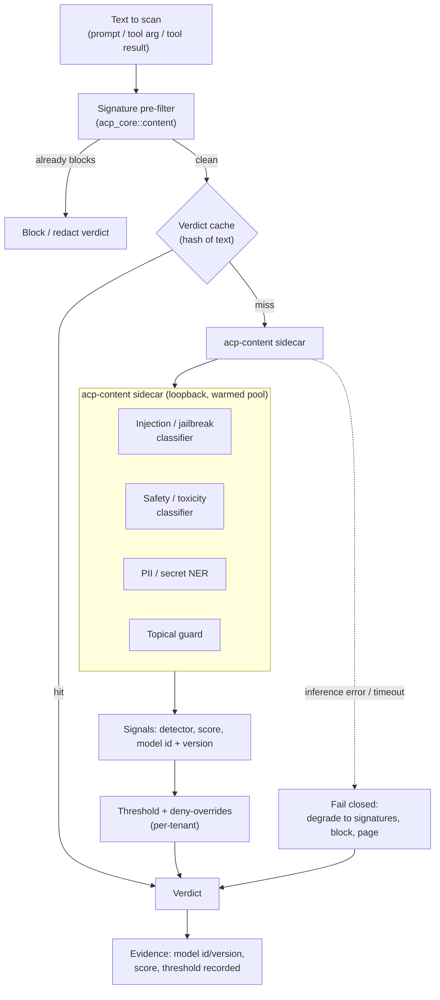

# ML-based content engine

Date: 2026-09-20
Status: design. Supersedes the honest boundary noted in `docs/design/gap-closure.md` and `docs/positioning.md`: the first-party content firewall (`acp_core::content`) is signature and regex based, which misses novel, paraphrased and obfuscated attacks. This document designs the trained-ML content engine that replaces signatures as the primary detector while keeping them as a fast pre-filter. Reads with `docs/positioning.md` (on-prem, no cloud) and `docs/model-cards/classifiers.md`.

## 1. What it is

A set of trained machine-learning classifiers that decide, for a piece of text (a model prompt, a tool-call argument, or a tool result), whether it is a prompt-injection or jailbreak attempt, is toxic or unsafe, contains personal or secret data, or is off-policy by topic. It replaces the deterministic signature engine as the primary detector behind the same seam the rest of ACP already calls, so nothing upstream changes: the gateway and the proxy still ask "scan this text" and get back a block or redact verdict.

It is not a single model. It is a small suite of specialised detectors, because one model that does everything is both weaker and slower than several that each do one thing well:

- an injection and jailbreak classifier (the headline detector),
- a safety and toxicity classifier,
- a PII and secret recogniser (named-entity recognition, not just regex),
- an optional topical guard for per-tenant denied topics.

## 2. Why it is needed

The signature engine catches known-shape attacks. It cannot catch what it has no pattern for, and attackers do not use the exact phrasing in a signature list. Concretely, the signature engine misses:

- Paraphrase. "disregard everything above" versus "ignore all previous instructions": a regex needs both; a classifier learns the intent.
- Obfuscation. Base64, unicode homoglyphs, zero-width characters, leetspeak, translation into another language, and instruction-splitting across turns all defeat literal matching.
- Novelty. New jailbreak families appear weekly. A signature list is always behind; a model generalises to unseen phrasings and can be retrained on new families.
- Indirect injection. Malicious instructions embedded in a tool result or a fetched document, phrased naturally, look nothing like a signature but are the most important agent attack surface.
- PII beyond patterns. A name, an address or a medical detail has no regex; NER finds it.

The market bar (Lakera, Cisco AI Defense, Protect AI, HiddenLayer) is trained classifiers with published precision and recall. To be a credible content firewall rather than a baseline filter, ACP needs the same. The `gap-analysis.md` study is explicit that content detection is an ML problem; this closes it on ACP's own terms rather than by depending on an external vendor.

## 3. Constraints that shape the design

These are non-negotiable and rule out most off-the-shelf approaches:

1. Fully on-prem and air-gappable. No cloud inference API. Models run inside the customer's environment, on CPU by default, GPU optionally. This is the positioning anchor and the reason ACP exists.
2. In-path and low-latency. The engine sits in the request path on the single-reactor gateway and proxy. It must add tens of milliseconds, not hundreds, or it becomes a bottleneck. This caps model size and forces batching and caching.
3. Fail-closed and deterministic evidence. On an inference error or a timeout the verdict must fail closed (block or degrade to signatures), never silently allow. Every decision must record which model and version scored it, the score, and the threshold, so the decision is reproducible and defensible in the ledger.
4. Reproducible and pinned. A model is an artifact with a digest; it passes the supply-chain admission gate and appears in the AI-BOM like any other. A given ACP version pins the model versions it ships with, so two installs score identically.

## 4. Architecture

### 4.1 The scorer seam

The existing `ContentPolicy` and `ContentVerdict` types stay. Behind them, introduce a `Scorer` abstraction so the engine is pluggable and testable:

- `trait Scorer { fn score(&self, text: &str, ctx: &ScanContext) -> Vec<Signal>; }`
- A `Signal` carries `{ detector, label, score (0.0..1.0), model_id, model_version }`.
- The verdict layer turns signals into block or redact by comparing each score against a configured, per-detector, per-tenant threshold, with deny-overrides across detectors (any detector over its block threshold blocks).

Two scorers ship, and they run as a defence-in-depth ensemble:

- `SignatureScorer` (the current `acp_core::content` engine), kept as a fast, zero-dependency pre-filter and as the fail-closed fallback.
- `MlScorer` (this design), the primary detector.

Blending rule: run the signature pre-filter first (sub-millisecond); if it already blocks, block. Otherwise run the ML scorer. This bounds cost (obvious attacks never reach the model) and keeps a working detector when the ML runtime is unavailable.

### 4.2 The detector suite

| Detector | Task | Model shape | Output |
|---|---|---|---|
| Injection / jailbreak | binary or multi-class sequence classification | small fine-tuned encoder (DeBERTa-v3-small / DistilBERT class), 20 to 80M params | score per class |
| Safety / toxicity | multi-label sequence classification | same encoder family, or a small guard LLM | score per harm category |
| PII / secret | token classification (NER) | small NER encoder + a validation pass (checksums for cards, entropy for secrets) | typed spans to redact |
| Topical guard | zero-shot or per-tenant fine-tune | small encoder with label embeddings | score per denied topic |

Small encoders are the default because they are CPU-friendly, quantisable, and fast enough in-path. A small guard LLM (Llama-Guard-style, GGUF-quantised) is an optional heavier detector for customers who accept more latency for broader coverage.

### 4.3 Inference runtime

Rust-native and on-prem, no Python at runtime:

- Primary: ONNX Runtime via the `ort` crate. Models are exported to ONNX and quantised to int8; ONNX Runtime gives CPU and GPU execution providers behind one API. This is the pragmatic default (mature, fast, wide model support).
- Alternative: Candle (Rust-native tensors) for a pure-Rust build with no C++ runtime, at the cost of supporting fewer model formats.
- Guard LLM option: llama.cpp via a Rust binding, GGUF-quantised, for the optional heavier detector.

Deployment shape: an inference sidecar (`acp-content`) that loads the models once and exposes a tiny local scoring endpoint over loopback, so the gateway and proxy share one warmed model pool and model loading never blocks the reactor. In-process embedding is possible for a single-binary install but the sidecar is the default because it isolates model memory and lets the engine scale and restart independently.

### 4.4 Model registry and provenance

Models are artifacts. Each model ships with a digest, a version and a model card. On load, the sidecar verifies the digest against the pinned value; a mismatch fails closed (the model does not load, the engine degrades to signatures and pages). Models pass the same `acp_core::supplychain` admission gate and appear in the `acp aibom` output, so "what is scoring my content, and where did it come from" is answerable with evidence.

## 5. How it works (request flow)

Diagram source (mermaid)

The flow: a fast signature pre-filter drops obvious attacks; a content-hash cache short-circuits repeat text; otherwise the sidecar scores with the detector suite; scores become a verdict by per-tenant thresholds with deny-overrides; the verdict, the model id and version, the score and the threshold are recorded to the tamper-evident ledger. Any inference error or timeout fails closed to the signature verdict and pages.

## 6. Evidence and reproducibility

Every content decision records the model id and version, the raw score, and the threshold applied, alongside the usual decision fields. This means:

- A regulator or an auditor can see not just "blocked by content policy" but "injection classifier v2.3 scored 0.94 against a 0.80 threshold".
- Re-running the same model version on the same input reproduces the score, because the model is pinned by digest and inference is deterministic at int8 with a fixed execution provider.
- A false-positive dispute is resolvable: the exact model and input are on the record.

The raw scanned text is never stored in the clear; only its hash and the derived signals, consistent with ACP's existing redaction and args-hash policy.

## 7. Latency and resource budget

- Target: p95 added latency under 30 ms per scan on CPU for the small-encoder detectors, with int8 quantisation and batching. The guard-LLM option is opt-in and budgeted separately.
- Batching: the sidecar batches concurrent scans into one inference call where possible.
- Caching: a bounded LRU keyed on the text hash short-circuits repeated identical scans (common with retried or templated prompts).
- Truncation: inputs are truncated to the model's context window with a sliding window over long tool results, so a huge document cannot blow the budget.
- Placement: CPU by default; GPU execution provider when available. The sidecar advertises readiness only once models are warm, so the gateway and proxy never route to a cold pool.

## 8. Failure modes and fail-closed behaviour

- Inference error or timeout: fall back to the signature verdict, and treat a signature-clean result as a block when the tenant sets `content_ml_required` (a high-assurance mode), or as allow-with-a-recorded-degradation otherwise. Either way the degradation is recorded and paged.
- Model digest mismatch on load: the model does not load; the engine runs signatures only and reports unhealthy.
- Sidecar unreachable: the gateway and proxy treat it as an inference error (above), so a dead sidecar never opens the gate silently.
- Adversarial evasion: no classifier is perfect; the signature layer, the topical guard and the redaction pass are independent, so an evasion of one is not an evasion of all. Continuous red-teaming (below) feeds retraining.

## 9. Training, evaluation and calibration

- Datasets: public prompt-injection and jailbreak corpora, safety and toxicity sets, PII NER sets, plus customer-contributed and red-team examples, all kept on-prem. No customer data leaves the environment for training.
- Targets: published precision and recall per detector, with a deliberately high recall on injection (a missed attack is worse than a false positive, which a human can clear).
- The existing `classify-eval` CLI and the `acp_core::classify` evaluation harness extend to the ML detectors: precision, recall, FPR against a labelled set, gated in CI so a model regression cannot ship.
- Calibration: thresholds are set from the precision-recall curve per detector and per tenant, not hard-coded. `acp_core::tuning` (the confusion-matrix feedback loop) and `acp_core::shadoweval` (candidate-versus-current rate diffs) drive threshold and model promotion decisions from real traffic.
- Drift: `acp_core::drift` and `acp_core::anomaly` watch live hit-rates so a sudden shift (a new attack wave, or a bad model) is caught.

## 10. Rollout

- Shadow first. A new model or threshold runs in shadow mode (`acp_core::posture` Stage::Shadow): it scores and records what it would block, without blocking, so the operator sees the blast radius and the false-positive rate on real traffic before enforcing.
- Promote on evidence. `shadoweval` compares the candidate against the current model; promotion needs the candidate to be within tolerance on false positives and better on recall.
- Per-tenant thresholds. Different tenants accept different false-positive rates; thresholds are per-tenant, versioned and signed like any policy.

## 11. Deployment and air-gap

- Models ship as pinned, digest-verified artifacts, downloadable once and cached, or delivered on media for a fully air-gapped install.
- The sidecar runs as a container or a static binary next to each gateway and proxy instance, or as a shared pool addressed over loopback or the internal network.
- No outbound network is required at inference time. Model updates are an explicit, signed, admitted artifact change, not a silent auto-update.

## 12. What stays as it is, and what stays integrate

- The signature engine stays, as the pre-filter and the fail-closed fallback. It is not thrown away.
- The external content-scan hook stays, for a customer who has already standardised on a specific ML vendor and wants ACP to call it instead of, or in addition to, the built-in models.
- Everything upstream (the `ContentPolicy` and `ContentVerdict` seam, the gateway and proxy wiring, the ledger evidence) is unchanged; this design swaps the detector behind the seam, it does not re-plumb the call path.

## 13. Phasing

1. Introduce the `Scorer` seam and refactor the current engine into `SignatureScorer` behind it. No behaviour change; pure refactor with the existing tests.
2. Build the `acp-content` sidecar with the ONNX runtime and the injection or jailbreak detector only. Wire the gateway and proxy to call it, with the signature pre-filter and fail-closed fallback. Ship in shadow mode.
3. Add the PII or secret NER detector and the redaction path; then the safety or toxicity detector; then the topical guard.
4. Wire evidence (model id, version, score, threshold), the classify-eval CI gate, and the tuning, shadoweval, drift and posture loops for promotion.
5. Optional: the guard-LLM heavy detector for customers who accept its latency.

The through-line: keep the seam, keep the signature layer as the floor, put trained models behind it as the primary detector, run them fully on-prem, and make every score reproducible evidence.
