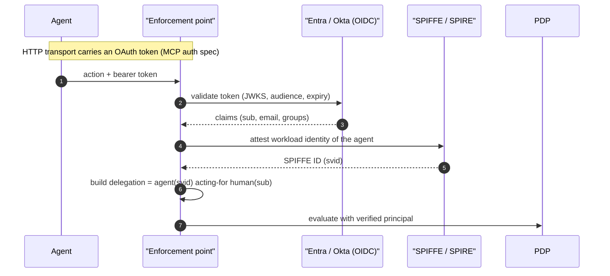
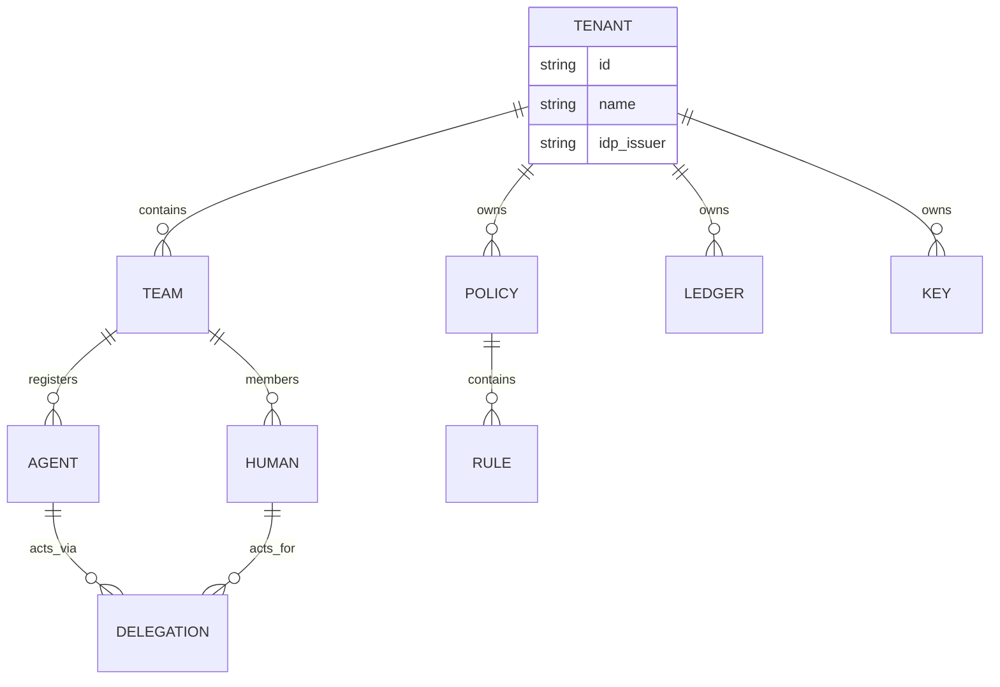

# Phase B: platform-ready control plane

Date: 2026-09-18
Status: design. Makes the control plane safe for a whole org: real identity (so the human principal stops being mocked), multi-tenancy, role-based access, and a decision stream to the SIEM. Prerequisite for every later phase, because they all rely on verified identity and tenant isolation.

## Purpose

Today the human principal is bound at enrolment (`--principal`) and degrades to `unattributed`; there is one implicit tenant; anyone who can reach the control API can do anything. Phase B closes all three so the platform can be operated by many teams with least privilege and non-repudiable identity.

## B1. Identity: verified human + workload

- Humans: OIDC against the org IdP. The verified `sub` becomes the `principal_id`; `principal_source = oauth`; `verified = true`. Replaces the `--principal` fallback for HTTP transports. Local/stdio agents keep the enrolment binding but can be pinned to an SSO session.
- Workloads (agents, gateways, services): SPIFFE/SPIRE issues an attested SVID, so an agent's identity is proven by what it is, not a shared token. The registry token becomes a bootstrap credential; the SVID is the runtime identity.
- Provisioning: SCIM from the IdP keeps agents/humans/teams and their deprovisioning in sync, so a disabled user immediately fails verification everywhere.

Reuses `acp-registry` (HumanPrincipal, Delegation already exist) and `acp-auth` (OIDC scaffolding exists; Entra is currently mocked). The work is real JWKS validation, SPIFFE integration, and SCIM sync.

## B1a. Deployment prerequisites (what the operator provides)

Making identity real needs no secrets in ACP, only non-secret config plus one Azure step the operator owns. Documented here so it is part of the design, not an afterthought.

What ACP needs (non-secret config, in `EntraConfig` / a config file):

| Value | Meaning | Secret? |
|---|---|---|
| Tenant ID | the tenant GUID; issuer is `https://login.microsoftonline.com/{tenant}/v2.0` | no |
| Application (client) ID | the token `aud` must equal this | no |
| JWKS URI | `https://login.microsoftonline.com/{tenant}/discovery/v2.0/keys` (Entra rotates keys; ACP fetches and caches) | no, public |
| App role names | e.g. `PolicyAdmin`, `Approver`, `BreakGlassOperator`, `Auditor`, `Registrar`; mapped to ACP capabilities | no |

What ACP does NOT need: the client secret (verification uses Entra's public keys, not a secret), and never a password. A secret would only be needed if ACP itself initiated a login flow; as a resource server validating incoming tokens it needs none.

What the operator does once, in Azure:
1. Create an App Registration for ACP.
2. Define the App Roles above and assign users or groups to them (so tokens carry `roles`).
3. Provide the tenant id and application id for the config, and one real user token for a live end-to-end check.

Verification path (RS256 + rotating JWKS) is built and unit-tested offline with a self-signed RSA fixture; pointing it at a real tenant is only the config above. Until real values are supplied, the build ships mock placeholders (`tenant=common`, `aud=acp-app`) and the `MockEntra` EdDSA issuer for tests, so nothing above the JWKS seam changes when real Entra is wired.

## B2. Multi-tenancy - NOT BUILT (dropped)

DECISION (2026-09-19): ACP is an on-prem service for a single organisation, not a cloud/SaaS
product, so tenant isolation is unnecessary. A single shared control plane (one policy set, one
evidence ledger, one key set) is correct; the display-only Team grouping already organises agents
without isolation machinery. The design below is retained only as a reference in case ACP is ever
offered as a hosted multi-org service. It is NOT on the build list.

### (reference only) Multi-tenancy

Every object is tenant-scoped: policy stores, evidence ledgers, signing keys, registries. A PEP is bound to a tenant at enrolment; cross-tenant reads are impossible by construction (separate stores plus a tenant claim checked on every control-API call). This mirrors the existing single-tenant layout, lifted under a `tenant_id`.

## B3. RBAC (who governs what)

| Role | Can |
|---|---|
| admin | manage tenants, keys, roles |
| policy-author | edit and deploy policy (signed) |
| approver | resolve step-up approvals (separation of duty: cannot approve own agent) |
| break-glass-operator | engage / clear the kill-switch |
| auditor | read evidence and reports, nothing mutating |
| registrar | register / revoke agents and humans |

Enforced at the control API and surfaced in the console. Roles come from IdP groups via the OIDC claims, so access is provisioned centrally. `acp-auth` already models RBAC; the work is binding roles to every control endpoint and to console actions.

## B4. SIEM export

The evidence plane streams every decision (allow / deny / step-up / obligation / kill-switch / integrity-alert) to the org SIEM in a standard schema (OCSF or CEF, both already emitted by the proxy events). Analysts get agent + human + resource + operation + verdict per event, joinable with the rest of the security estate.

## Work items

1. OIDC token validation in the PEPs (JWKS cache, audience/issuer/expiry), mapping `sub` to the verified principal. [acp-auth, acp-proxy]
2. SPIFFE/SPIRE workload identity for agents and gateways; SVID as the runtime agent id. [new acp-workload-id]
3. SCIM provisioning sync into the registry. [acp-registry]
4. Tenant scoping across registry, policy store, ledger, keys; tenant claim on every control call. [acp-server, acp-registry, acp-policy::store]
5. RBAC binding on every control endpoint and console action; roles from IdP groups. [acp-auth, acp-server, acp-console]
6. SIEM export of the decision stream (OCSF/CEF) with delivery guarantees. [acp-core::warehouse or a sink]

## Acceptance

A governed HTTP call resolves a real Entra user as the verified principal; two tenants cannot see each other's policy or evidence; a user without the policy-author role cannot deploy; every decision appears in the SIEM with agent + human + resource.
