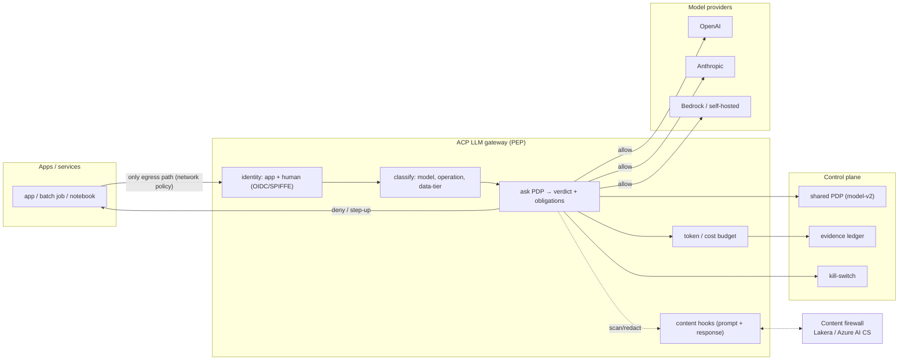
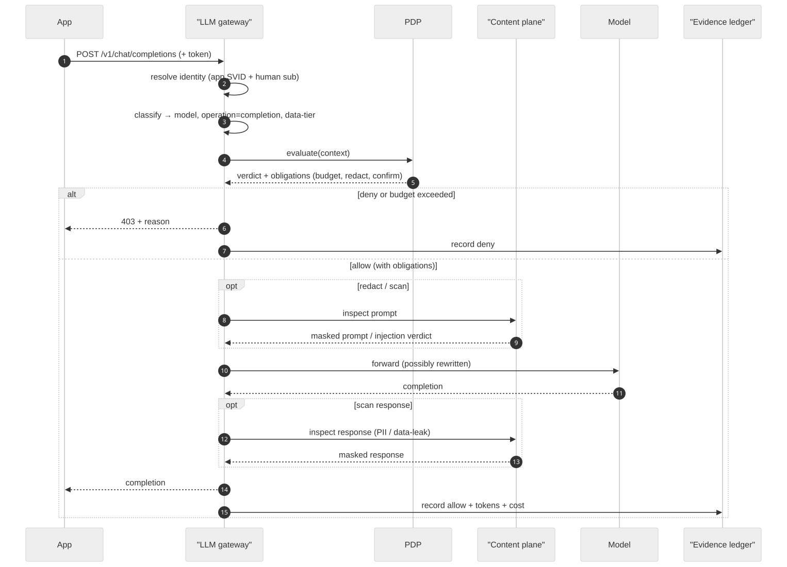
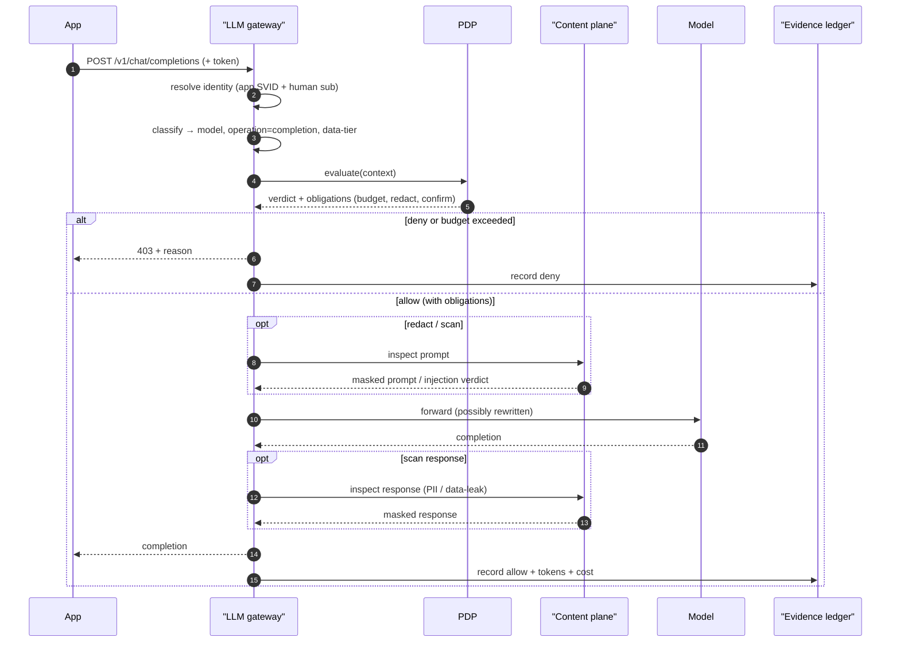

# Phase C: the LLM gateway PEP

Date: 2026-09-18
Status: design. Adds a second enforcement point that governs direct model API usage (apps and services calling OpenAI, Anthropic, Bedrock, and self-hosted models), the single largest surface ACP does not yet cover. It runs on the exact machinery already built: the same PDP, identity, evidence ledger, kill-switch, and obligations.

## Purpose

Not all AI is agentic. Most enterprise AI spend is apps and services calling a model API directly. Ungoverned, that path leaks data, ignores which models are approved, and produces no evidence. The gateway is a reverse proxy that every model call goes through, so the same policy that governs agents now governs raw model access.

## Architecture

Diagram source (mermaid)

## Request lifecycle

Diagram source (mermaid)

## Mapping a model call into the model-v2 context

| model-v2 field | For a model API call |
|---|---|
| subject | the calling app/service (SPIFFE) and the human it acts for (OIDC), same as an agent |
| action / operation | `completion`, `embedding`, `image`, `moderation` |
| resource | the model class (for example `frontier`, `gpt-4o`, `internal-only`) and/or the data tier the prompt touches |
| context | prompt (for the scan obligation), token budget, running cost, environment |
| effect | allow / deny / step-up / obligations (redact prompt or response, cost/token cap, block on injection) |

So a rule reads exactly like an agent rule: `when: { resource: frontier, principal: unattributed } verdict: deny`, or `when: { resource: gpt-4o } obligations: [{ kind: rate_limit, max: 1000000, window_ms: 86400000 }]` for a daily token budget. Budgets are the rate_limit obligation generalised from calls to tokens/cost.

## What it reuses vs adds

- Reuses [BUILT]: the PDP engine, identity/delegation, the evidence ledger, the kill-switch, and the obligation framework (redact, rate_limit, confirm).
- Adds [TO BUILD]: an axum reverse proxy speaking the OpenAI/Anthropic/Bedrock wire formats; a token/cost meter (extends `acp-core::metering`); a `scan` obligation that calls the content plane; model-class taxonomy (mirrors the tool-to-resource taxonomy).

## Work items

1. Gateway service: reverse proxy for the major model wire formats, streaming-aware. [new acp-gateway]
2. Model-class taxonomy: request to (resource, operation), like the tool taxonomy. [acp-core::resource sibling]
3. Token/cost metering and budget obligation. [acp-core::metering, acp-policy obligations]
4. `scan` obligation calling the content plane (Lakera / Azure AI Content Safety) on prompt and response. [acp-policy, integration]
5. Evidence records for model calls (same shape, source=gateway). [acp-proxy::evidence shared]
6. Kill-switch scope `model:<class>` so "freeze frontier-model access" is one action. [acp-core::breakglass Scope]

## Acceptance

An app calling a model through the gateway is allowed or denied by the same policy language as an agent; a daily token budget denies once spent; a prompt with PII is redacted via the content plane before it leaves; every call is in the same ledger with app + human + model; a `model:frontier` kill-switch freezes exactly that.
