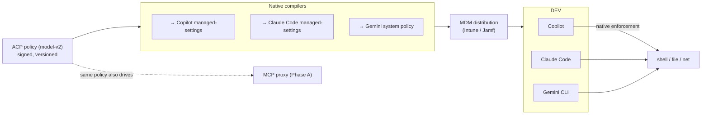

# Phase D: agent-native policy sync

Date: 2026-09-18
Status: design. Governs a coding agent's non-MCP powers (shell, file edits, direct network) without re-implementing its sandbox, by making ACP the single source of policy that compiles down into each vendor's own managed-settings. The agent stays the enforcer; ACP becomes the origin.

## Purpose

The exclusion map (`docs/research/policy-model-study.md`) showed the coding agents already enforce shell/file/network well through their own sandboxes and, now, admin-deployable managed settings. The gap is that each vendor's policy is a silo in a different format, editable per developer. Phase D closes it: author once in ACP, compile to Copilot / Claude Code / Gemini managed-settings, distribute via MDM so the developer cannot loosen it. One policy, enforced by each agent's own trusted mechanism.

## Flow

## Mapping model-v2 to native rules

| model-v2 | Copilot | Claude Code | Gemini |
|---|---|---|---|
| deny resource:filesystem op:write outside repo | permissions.deny Write | deny Edit(path) rules | policy-engine deny Write |
| deny resource:network egress to non-allowlisted | denied network domains | WebFetch deny + sandbox net | sandbox net off + allow domains |
| step-up resource:secrets | permissions.ask | ask rules | ask_user policy |
| disable bypass / YOLO | disableBypassPermissionsMode | disableBypassPermissionsMode | disableYoloMode |

The mapping is lossy in both directions (each vendor expresses less than model-v2), so the compiler emits the strictest faithful translation and logs what could not be expressed, rather than silently dropping it. Where a vendor cannot express a rule, that action is routed through the MCP proxy instead (which can), so nothing falls through.

## Reuses vs adds

- Reuses [BUILT]: the model-v2 policy as the single source; the signing/versioning of the policy store.
- Adds [TO BUILD]: three target compilers; a distribution manifest for MDM; a coverage report (what each vendor could not express).

## Work items

1. Policy-to-native compiler framework with a per-vendor backend. [new acp-nativecompile]
2. Copilot, Claude Code, Gemini backends, each emitting managed-settings.
3. Coverage/loss report so gaps are visible and routed to the proxy.
4. MDM distribution manifest and a verification probe (confirm the machine actually applied it).

## Acceptance

One authored ACP policy produces valid managed-settings for all three agents; a developer cannot loosen them locally (MDM-enforced); any rule a vendor cannot express is reported and covered by the proxy; the whole set traces to one signed policy version.
