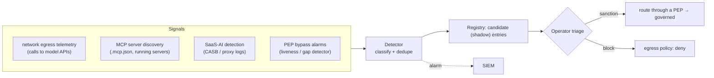

# Phase E: the discovery plane

Date: 2026-09-18
Status: design. Governance starts with knowing what exists. Discovery finds AI usage across the org (including shadow AI) and feeds it into the registry, so the platform governs what it finds, not only what was registered.

## Purpose

ACP governs agents and apps that are registered and routed through a PEP. Anything unregistered is invisible. Discovery turns that around: continuously detect AI activity, surface it, and drive it to sanctioned-and-governed or blocked.

## Flow

The PEP bypass alarm already exists in embryo: the liveness gap detector flags a proxy that heartbeats but stops emitting decisions while traffic is expected. Phase E generalises "traffic to a model endpoint that did not pass a gateway" into a first-class shadow-AI signal.

## Work items

1. Egress telemetry ingestion (from a network sensor, proxy logs, or eBPF) identifying model-API and MCP traffic. [new acp-discovery]
2. Detector: classify endpoints, dedupe, and create shadow registry candidates.
3. Registry candidate lifecycle: shadow -> sanctioned (routed) or blocked (egress deny).
4. Bypass detection generalised across PEP types, alarming to the SIEM.

## Acceptance

A model API call that bypassed the gateway is detected and surfaced as a shadow candidate; an operator can sanction it (route through a PEP) or block it (egress policy); bypass attempts alarm.
