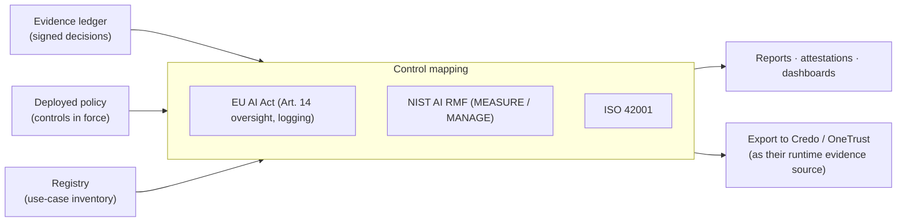

# Phase F: GRC projection

Date: 2026-09-18
Status: design. Projects the signed evidence ledger and the deployed policy into compliance artifacts. ACP is uniquely placed to make governance evidence-backed rather than questionnaire-backed, because it holds the tamper-evident runtime record of what every agent and app actually did.

## Purpose

GRC platforms (Credo, OneTrust) produce control mappings and reports from attestations and documents. ACP can supply the missing half: the runtime proof. Phase F is a light projection layer (not a GRC suite) that maps the ledger and policy to framework controls and emits reports, and that can also feed a full GRC suite as its evidence source.

## Flow

Diagram source (mermaid)

## What maps to what

| Framework control | ACP evidence |
|---|---|
| EU AI Act human oversight (Art. 14) | step-up approvals + kill-switch records |
| Logging / traceability | the signed Merkle ledger, re-derivable |
| Access control | policy in force + per-decision verdicts |
| Data governance | redact obligations + resource-scoped rules |
| Incident response | kill-switch engage/clear meta-audit |

## Work items

1. Control-mapping definitions (framework control to the evidence/policy that satisfies it). [new acp-grc, data-driven]
2. Use-case inventory view over the registry (teams, agents, resources, models).
3. Report generation (audit-ready, per framework) from the ledger.
4. Export adapter to feed Credo / OneTrust as the runtime evidence source.

## Acceptance

An auditor can pull an EU AI Act oversight report backed by real step-up and kill-switch records; a use-case inventory lists every governed agent/app/model; the same evidence can be exported to a GRC suite.
