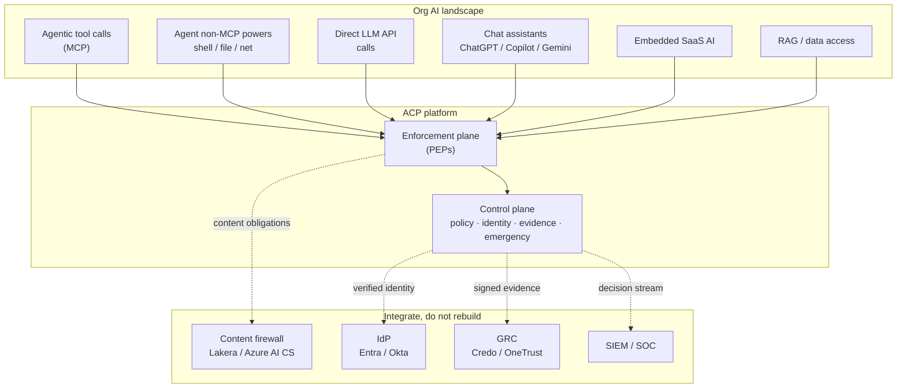
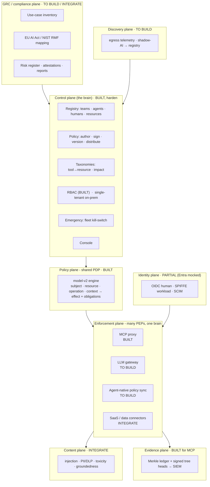
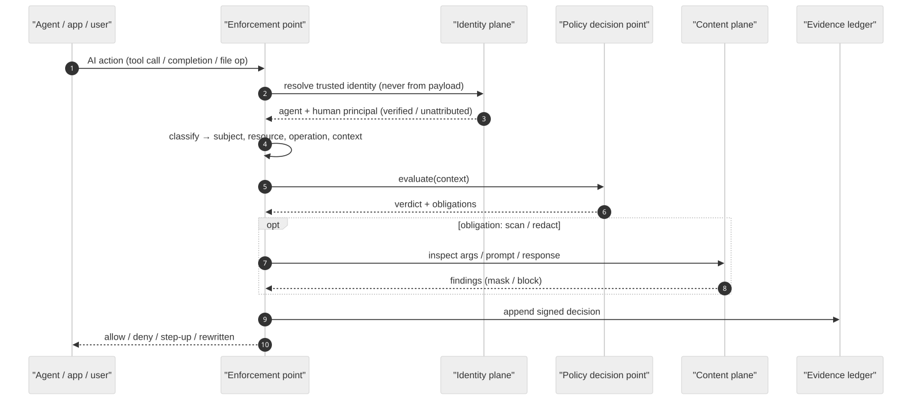
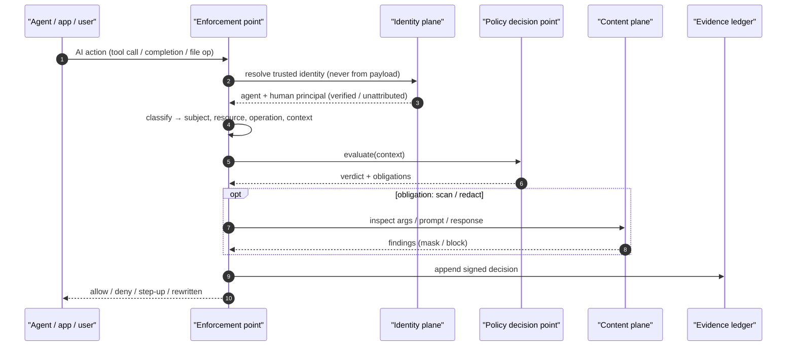
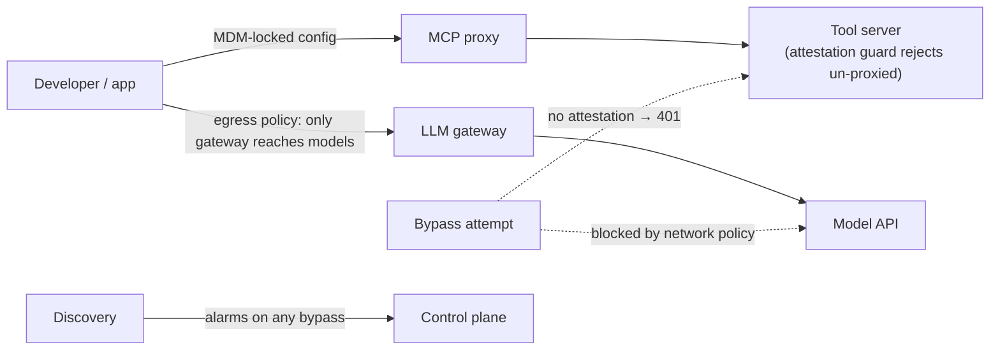

# Varman (ACP) platform architecture: governing the AI landscape end to end

Date: 2026-09-18
Status: reference architecture and north-star. Extends `docs/positioning.md` (the wedge) and `docs/design/model-v2.md` (the shipped enforcement-and-evidence core) into a full org AI-governance platform. Per-phase designs live in `phase-b-control-plane.md` ... `phase-f-grc.md`; the sequenced build is in `platform-plan.md`. Honesty markers: [BUILT], [PARTIAL], [TO BUILD], [INTEGRATE]. Build-status update (2026-09-21): the diagrams below were drawn on 2026-09-18; since then phases C, D, E and F have SHIPPED (see the note under section 0), so treat any [TO BUILD] label in a diagram or the coverage table as superseded by that note.

## 0. The core idea

Build-status update (2026-09-21): what the 2026-09-18 diagrams mark [TO BUILD] has largely shipped. The LLM gateway (phase C) is `acp-gateway`; agent-native policy sync (phase D) is `acp-nativecompile`; the discovery plane (phase E) is `acp_core::discovery` plus the enrollment loop; the GRC plane (phase F) is `acp_core::grc`/`controls`/`conformity`/`assessment` (note: these shipped as modules inside `acp-core`, not as standalone `acp-discovery`/`acp-grc` crates); the content plane is now a first-party content firewall (`acp_core::content`), not an integration. Only SPIFFE/SPIRE workload identity (phase B) and encryption-at-rest wiring remain unbuilt. The prose and diagrams below are kept as the reference architecture; the markers are as of 2026-09-18.

Governing "the AI landscape" is finite because of one pattern: **one control plane, many enforcement points**. A single brain (policy, identity, evidence, emergency) drives many thin adapters (PEPs), each intercepting one class of AI action, building a trusted context, asking the same decision point, enforcing, and writing the same tamper-evident ledger. Covering a new surface is adding a PEP, not building a new platform. ACP already is the brain plus one PEP (the MCP proxy).

## 1. Context: what must be governed, and how ACP sits

Diagram source (mermaid)

## 2. The planes

Diagram source (mermaid)

Per-plane detail (purpose, components, status) is in the phase design docs. The one-line reading: the control plane authors and signs one policy, the shared PDP decides, and every PEP enforces the same decision and writes the same ledger.

## 3. The enforcement-point (PEP) pattern

Every PEP, whatever the surface, is the same five steps. This is why the platform is finite: a new surface is a small adapter that inherits identity, policy, evidence, obligations, and the kill-switch for free.

Diagram source (mermaid)

## 4. Coverage matrix

| AI surface | PEP | Status | Closes the gap |
|---|---|---|---|
| MCP agent tool calls | MCP proxy | [BUILT] | done |
| Agent shell / file / network | native policy sync | [BUILT: acp-nativecompile] | compile one policy to vendor managed-settings |
| Direct LLM API | LLM gateway | [BUILT: acp-gateway] | reverse proxy + budgets + content firewall |
| Chat assistants | vendor admin + DLP | [INTEGRATE] | Purview / vendor enterprise controls |
| Embedded SaaS AI | CASB / DLP connector | [INTEGRATE] | connectors feed policy + evidence |
| RAG / data access | data gateway | [PARTIAL] | resource-model governance on retrieval |
| Model lifecycle / risk | GRC plane | [BUILT: acp_core::grc + controls/conformity/assessment] | inventory + control mapping over the ledger |
| Shadow AI | discovery plane | [BUILT: acp_core::discovery + enrollment] | egress telemetry to registry |

## 5. Making it unavoidable at org scale

Coverage on paper is not governance; the PEPs must be the only path.

Diagram source (mermaid)

Unavoidability is an org rollout (network policy plus MDM plus gateway plus the attestation guard from `docs/design/enforcement.md`), enabled by the platform, not a single toggle. Stated plainly to anyone evaluating it.

## 6. Build / integrate / never

- Build: control plane, PDP, the PEPs (MCP proxy, LLM gateway, native sync), evidence, identity wiring, discovery, a light GRC projection.
- Built first-party (scope change 2026-09-20): the content firewall (`acp_core::content`, a trained classifier plus signatures) and the GRC lifecycle. Integrate: the IdP (Entra / Okta), SIEM, CASB/DLP for SaaS, model/artifact scanning, and optionally an external content ML classifier or a GRC suite (Credo / OneTrust) as an evidence consumer where one is already in place.
- Do not rebuild: an IdP, a SIEM, or a coding agent's own sandbox. Those are other people's moats; ours is the neutral authorisation-identity-evidence core across every surface, now with a first-party content firewall and GRC lifecycle on top.

## 7. Honest status

Phase A (the MCP core) shipped first; phases C, D, E and F have since shipped too (see the build-status update in section 0), mostly as modules inside `acp-core`. The remaining unbuilt items are SPIFFE/SPIRE workload identity and encryption-at-rest wiring. Today ACP governs MCP agent tool calls end to end with verified identity, tamper-evident evidence, obligations, tool-integrity, and a hardened kill-switch. This architecture is how that core becomes full-landscape coverage without leaving its lane; `platform-plan.md` is the order to build it.
