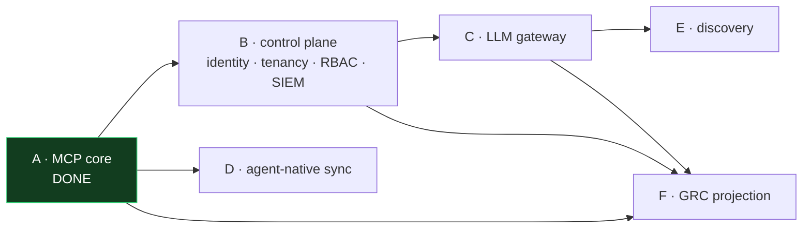
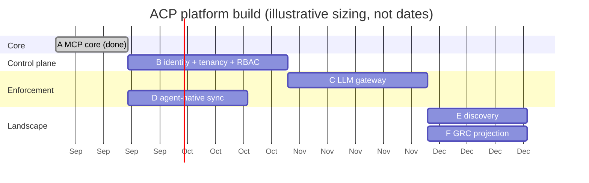
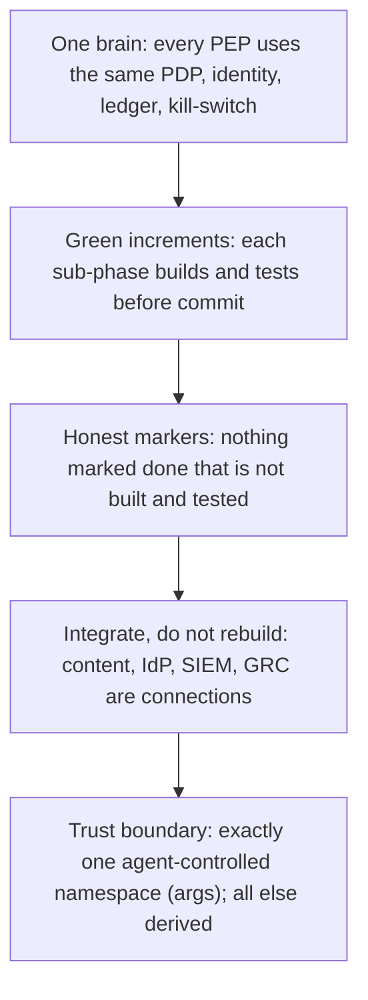

# ACP platform plan: from core to full-landscape governance

Date: 2026-09-18
Status: the sequenced build plan for the architecture in `platform-architecture.md`. Each phase ships on the same brain (control plane, PDP, evidence, kill-switch) built in Phase A, so none requires a rewrite and each is independently valuable. Designs: `phase-b-control-plane.md` ... `phase-f-grc.md`.

## Phases at a glance

| Phase | Delivers | Status |
|---|---|---|
| A | MCP enforcement-and-evidence core (model-v2) | DONE, shipped and tested |
| B | Platform control plane: real identity, RBAC, SIEM (multi-tenancy DROPPED: on-prem single-org) | mostly built |
| C | LLM gateway PEP: govern direct model API usage | design done |
| D | Agent-native policy sync: govern non-MCP agent powers | design done |
| E | Discovery plane: find shadow AI, feed the registry | design done |
| F | GRC projection: evidence-backed compliance | design done |

## Dependencies

Reading: B (identity + tenancy) unblocks everything that needs a verified principal and tenant isolation, so it is the true next step. C (the gateway) needs B's identity and is the highest-value surface. D (native sync) only needs A's policy, so it can run in parallel with B/C. E (discovery) needs C to detect model traffic meaningfully. F (GRC) needs evidence from A and C.

## Illustrative sizing

Durations are relative sizing to show sequencing and parallelism, not date commitments.

## Work breakdown

Each phase's work items and acceptance criteria are in its design doc. Summary of the build surface:

- B [acp-auth, acp-registry, acp-server, acp-console, new acp-workload-id]: OIDC validation, SPIFFE SVIDs, SCIM sync, tenant scoping, RBAC binding, SIEM export.
- C [new acp-gateway, acp-core::resource/metering, acp-policy]: reverse proxy for model wire formats, model-class taxonomy, token/cost budgets, `scan` obligation, gateway evidence, `model:` kill-switch scope.
- D [new acp-nativecompile]: policy-to-native compiler framework, Copilot/Claude/Gemini backends, coverage report, MDM manifest.
- E [new acp-discovery]: egress telemetry ingestion, detector, shadow candidate lifecycle, cross-PEP bypass alarms.
- F [new acp-grc]: control-mapping definitions, use-case inventory, report generation, Credo/OneTrust export.

## Principles held across every phase

## Recommended order

1. B first (unblocks all; ends the mocked-identity gap so the human principal is always verified).
2. C next (largest uncovered surface, on machinery that exists).
3. D in parallel with B/C (independent; closes the non-MCP agent gap).
4. E then F (need C's coverage and evidence).

## Definition of full-platform done

Every AI action surface in the coverage matrix is either governed by a PEP or explicitly integrated; every decision across every surface lands in one tamper-evident ledger keyed by verified agent and human identity; one policy language governs all of it; a scoped kill-switch reaches every surface; and an auditor can pull an evidence-backed compliance report. At that point ACP governs the AI landscape in its entirety, without having become a content firewall or a GRC suite.
