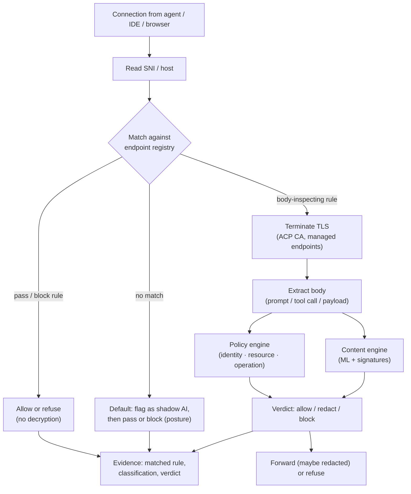

# Configuration-driven traffic interception

Date: 2026-09-20
Status: design, phases 1, 2 and 3 IMPLEMENTED (see the phasing section). Generalises the explicit gateway and MCP proxy into a universal, endpoint-registry-driven interception layer, so ACP governs what agents, IDEs and browsers send to any AI endpoint, not only the ones wired to talk to ACP directly. Reads with `docs/design/ml-based-content-engine.md` (the analysis behind the inspection), `docs/design/enforcement.md` (unavoidability), and the discovery/enrollment/coverage work in `docs/design/gap-closure.md`.

## 1. What this is, and the ask

Today ACP governs two paths that are wired to it on purpose: the LLM gateway (an app sets its base URL to ACP) and the MCP proxy (an agent runs its tool server through ACP). Anything else, a developer's IDE assistant talking straight to `claude.ai`, a browser tab using ChatGPT, a script hitting `api.openai.com`, is not seen.

The ask: intercept traffic based on configuration. A registry of endpoints, each with a match rule and an action. For example, if the destination host contains `claude.ai`, read the request body and run prompt analysis and governance on it; if it is an MCP endpoint, govern the tool call; if it is an internal system, scan for data exfiltration only. Register all such endpoints, and ACP intercepts everything an agent, an IDE or a browser sends, applying the right handler per endpoint.

This turns ACP from "governs what is pointed at it" into "governs what is configured to be governed, wherever it flows".

## 2. The model: an endpoint registry plus an interception layer

Two parts:

1. An endpoint rule registry. A signed, versioned list of endpoint rules. Each rule has a match (how to recognise the destination), a classification (model-api, mcp, saas-ai, internal, other), and an action (what ACP does with matching traffic). This is configuration, exactly as asked: you only inspect what you register, and you say per endpoint what inspection means.
2. An interception point. A forward proxy that all managed traffic flows through. For each connection it matches the destination against the registry, applies the rule's action, and records the decision. Unregistered destinations hit the default action (usually: flag as shadow AI, pass or block, per policy).

The registry is the source of truth; the interception point is the mechanism. Discovery feeds the registry (it finds candidate endpoints), enrollment turns a candidate into a rule, and coverage reports how much of the observed traffic is actually governed.

## 3. Endpoint rules

A rule is a match plus a classification plus an action.

Match predicates (any combination, all must hold):
- `host_contains`, `host_suffix`, `host_exact`
- `path_contains`, `path_prefix`
- `sni` (the TLS Server Name, matched before decryption)
- `port`

Actions:
- `inspect-prompt`: decrypt, extract the prompt or completion body, run the content engine (ML plus signatures) and the policy engine (identity, resource, operation), then allow, redact or block. This is the model-API case (claude.ai, api.openai.com, Copilot, Gemini).
- `govern-tool-call`: treat the body as an MCP or tool call and run it through the same decision path as the MCP proxy.
- `dlp-only`: scan the body for data exfiltration (PII, secrets) and block or redact, without model-call governance. This is the internal-system or SaaS case where the risk is data leaving, not a model being called.
- `block`: refuse the connection (a sanctioned-away or prohibited endpoint).
- `pass`: allow without inspection (explicitly trusted), still recorded as seen.

Default action for unregistered destinations: `flag` (record as shadow AI for the discovery loop) and then `pass` or `block` per the tenant's posture. A tenant in lockdown blocks by default; a tenant in shadow mode passes and records.

Example configuration:

```yaml
version: 1
default: flag-and-pass        # unregistered -> record as shadow AI, then pass
endpoints:
  - match: { host_contains: "claude.ai" }
    classify: model-api
    action: inspect-prompt
  - match: { host_contains: "api.anthropic.com" }
    classify: model-api
    action: inspect-prompt
  - match: { host_exact: "api.openai.com" }
    classify: model-api
    action: inspect-prompt
  - match: { host_suffix: "githubcopilot.com" }
    classify: model-api
    action: inspect-prompt
  - match: { path_contains: "/mcp" }
    classify: mcp
    action: govern-tool-call
  - match: { host_contains: "crm.internal" }
    classify: internal
    action: dlp-only
  - match: { host_contains: "deepseek.com" }
    classify: model-api
    action: block             # sanctioned away
```

## 4. How matching works

For each connection: read the SNI (available before TLS decryption), match it against the `sni`, `host_*` predicates; if a rule matches and its action needs the body, decrypt (see interception mechanisms) and match any `path_*` predicates on the request line. The first matching rule wins; no match falls to the default. The matched rule id, classification and action are stamped onto the decision so evidence shows exactly which rule governed the call.

Least-inspection by design: a rule whose SNI-level action is `pass` or `block` never decrypts. Only rules that need the body (`inspect-prompt`, `govern-tool-call`, `dlp-only`) terminate TLS. You decrypt only what you configured to inspect.

## 5. Interception mechanisms (and the honest constraints)

Reading the body of an HTTPS request means terminating TLS, which is the crux and the main deployment decision. The options, by surface:

- IDEs and coding agents. Prefer no interception at all: pin the base URL to ACP (already built, `native-compile --gateway`) and set the standard `HTTPS_PROXY` in the managed environment so the agent's own client routes through ACP. Clean, no MITM for these.
- Browsers. Either a forward proxy (a PAC file or `HTTPS_PROXY` pushed by MDM) or a browser extension that sees the request before TLS. The extension is the cleaner read (it sees plaintext in the page context, like the SentinelOne and Prompt Security model) and avoids MITM; the forward proxy is broader but needs TLS interception.
- Everything else (arbitrary apps, scripts). A transparent or explicit forward proxy on the network path.

TLS interception (MITM), when a rule needs the body and the client is not pointed at ACP:
- ACP presents a certificate for the destination signed by an ACP CA that the managed endpoints trust (the CA is installed by MDM, like any enterprise TLS-inspection or CASB deployment). This is a deliberate, visible trust decision the organisation makes, not a covert capture.
- Certificate pinning breaks this: some apps pin their server certificate and will refuse the ACP-presented one. Those endpoints cannot be body-inspected via MITM; govern them instead by base-URL pinning (if it is an app we configure), an extension (if it is a browser), or by `block`/`pass` at the SNI level. This is a real limit and the design states it rather than pretending otherwise.
- Only managed devices (with the ACP CA and the proxy settings) are covered. An unmanaged device is outside the perimeter; that is a device-management problem, not something ACP can solve on the wire.

The interception point reuses the existing engines: once the body is in hand, it is the same content engine, the same policy engine, the same evidence ledger as the gateway and proxy. This layer is about getting the body, not about re-deciding what to do with it.

## 6. Per-endpoint handler pipeline



<details>
<summary>Diagram source (mermaid)</summary>



</details>

The pipeline: recognise the destination, decide from the registry whether and how to inspect, decrypt only if the action needs the body, run the same content and policy engines the rest of ACP uses, then allow, redact or block, and record which rule governed the call.

## 7. Registration and the discovery loop

Endpoints get into the registry three ways:

- Seeded. The shipped rules for the common model APIs (Anthropic, OpenAI, Copilot, Gemini, and so on), so the obvious cases work out of the box.
- Discovered. `acp discover` and the interception point's own default-`flag` action surface unregistered destinations that look like AI (by the model-API host table and MCP signals). These appear as shadow AI.
- Enrolled. An operator turns a discovered endpoint into a rule with `acp enroll` (the existing signed-disposition loop), choosing the action. Enroll becomes "add an `inspect-prompt` or `govern-tool-call` rule"; quarantine becomes a `block` rule; accept-risk becomes a `pass` rule with an expiry.

So the registry is not hand-maintained in isolation: discovery finds, enrollment decides, and coverage measures.

## 8. Coverage tie-in

The coverage report (`acp coverage`) already cross-references observed endpoints against the governed set. With this layer, "governed" means "matched by a body-inspecting or block rule", and "ungoverned" means "hit the default". So coverage becomes a live measure of how much of the organisation's actual AI traffic is under inspection, and the canary can probe that a known endpoint is in fact intercepted rather than reaching the model directly.

## 9. Security and privacy

- Least inspection. Decrypt only endpoints whose rule needs the body. Everything else is matched at the SNI level and never decrypted. This is a privacy control and a performance control.
- No raw sensitive storage. As elsewhere in ACP, the ledger records the hash and the derived signals, not the raw prompt in the clear; redaction runs before anything is recorded or forwarded.
- Visible trust. TLS interception uses an organisation-installed CA on managed devices. It is an explicit enterprise decision, documented and scoped to the registered, body-inspecting endpoints.
- Fail-closed. If decryption or inspection fails on a body-inspecting rule, the connection fails closed (block) rather than passing uninspected, unless the tenant sets a pass-through degrade for that rule.

## 10. Phasing

1. The endpoint rule registry: the config schema, signed and versioned, plus the matcher (SNI and host and path predicates, first-match). Pure and unit-testable. DONE (`acp_core::interception`, `acp intercept`).
2. Explicit forward-proxy interception for the no-MITM surfaces: `HTTPS_PROXY` plus base-URL pinning for agents and IDEs, applying `inspect-prompt` and `govern-tool-call` by reusing the gateway and proxy decision paths. DONE (`acp-intercept`): CONNECT block/pass without decryption, full plain-HTTP body inspection, decisions recorded to the ledger.
3. TLS-interception mode (ACP CA) for body-inspecting rules on managed devices, with the cert-pinning limits documented and detected (a pinned endpoint is reported, not silently failed). DONE (`acp_intercept::mitm`, `acp-intercept gen-ca`, `--ca-cert`/`--ca-key`): per-host leaf minting, HTTP/1.1-only ALPN, pinning/handshake-failure detection, ledger outcomes.
4. The browser surface: an extension or PAC-based path.
5. Wire discovery, enrollment and coverage to the registry so the loop is find, decide, measure.

The through-line: one signed registry says which endpoints to inspect and how; one interception point gets the body only where configured; and from there it is the content engine, the policy engine and the evidence ledger ACP already has. That is how ACP comes to govern everything sent via agents, IDEs and browsers, by configuration, not by hoping every client was pointed at it.
