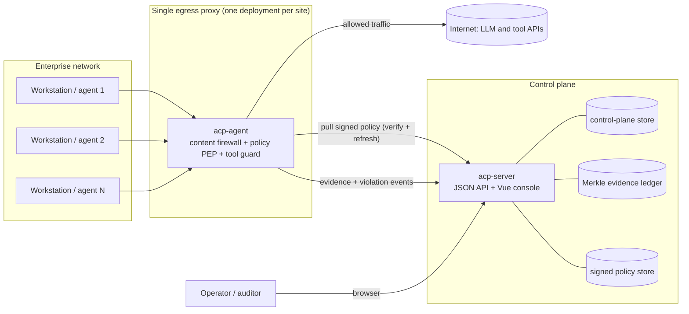
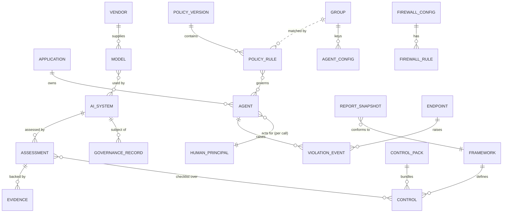
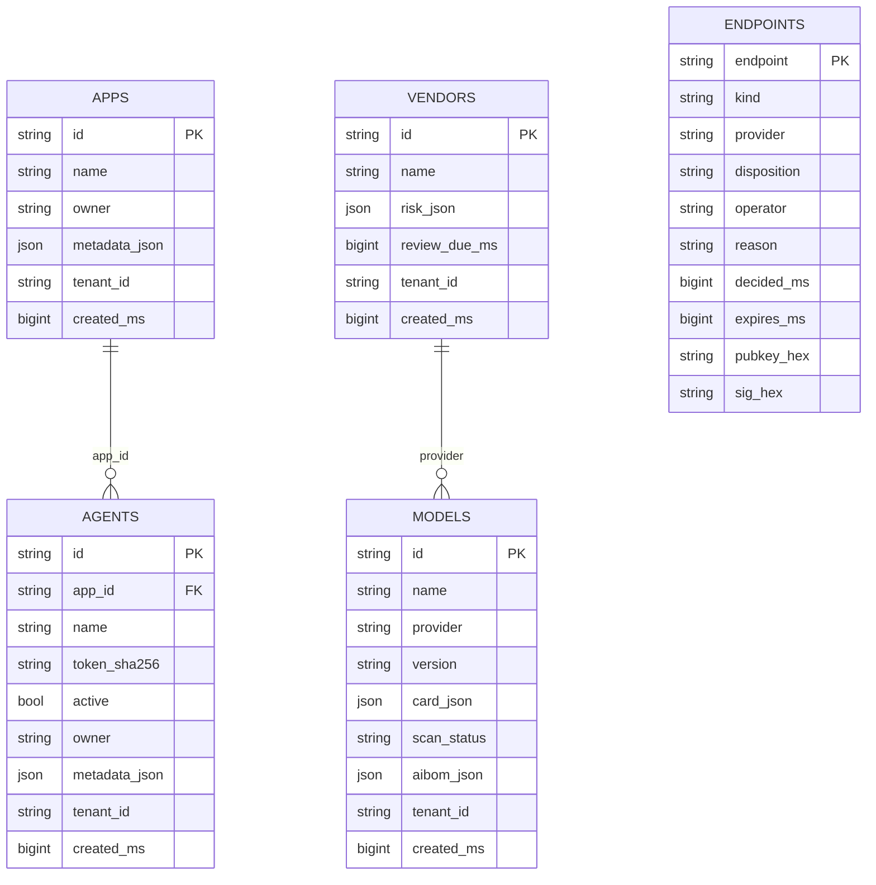
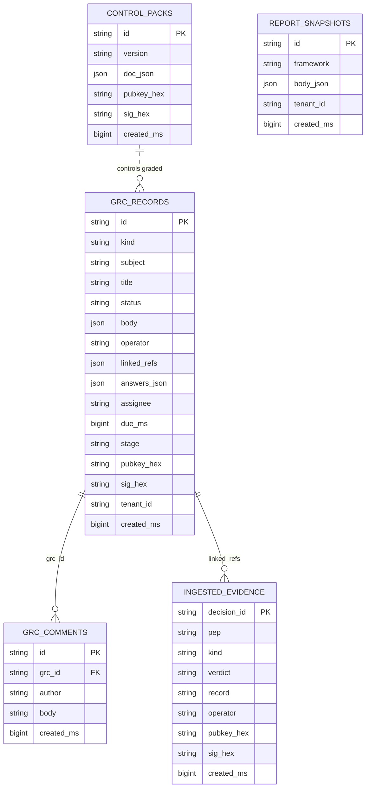
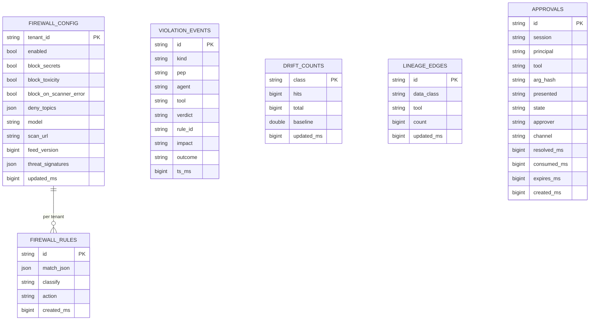
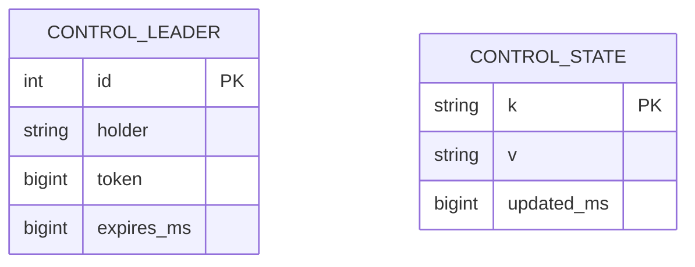
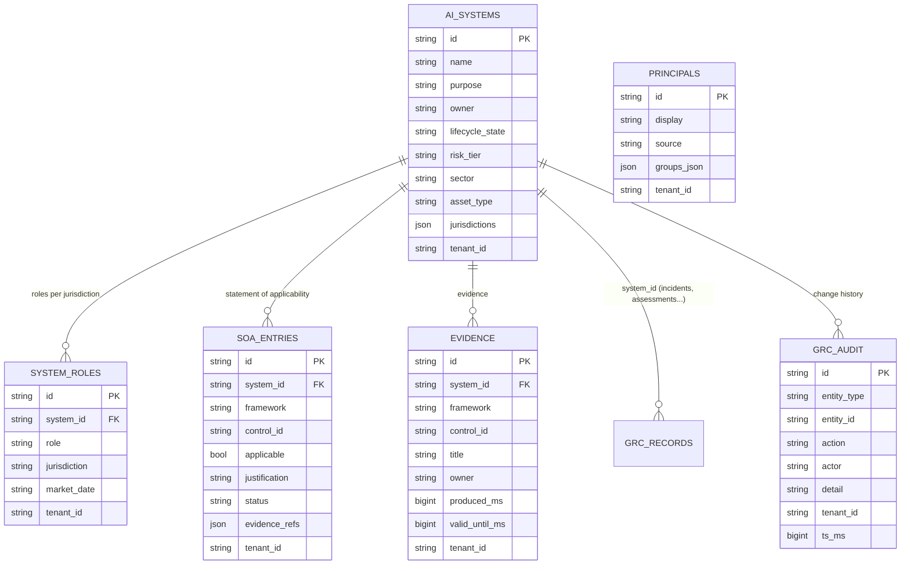

# Varman schema and architecture

This document describes the data model and the deployment shape of the Varman control plane: the
governance (GRC) side and the content-firewall side, together with the identity, policy and evidence
model that ties them together. Diagrams use Mermaid.

The control plane is the `acp-server` process (it also serves the Vue console). Enforcement happens in
`acp-agent`, which runs the content firewall, the policy decision point (PEP) and the tool guard.

---

## 1. Stores at a glance

Varman keeps state in a few purpose-built stores rather than one big database:

| Store | Backing | Holds |
| :--- | :--- | :--- |
| Control-plane store | SQLite (or Postgres) | Identity, governance records, firewall config and rules, endpoints, violations, drift, lineage, report snapshots, HA lease, a small KV table. |
| Approvals store | SQLite | Human-in-the-loop step-up approvals and their lifecycle. |
| Signed policy store | Files on disk | Versioned, hash-bound, signed policy manifests (the enforced policy). |
| Evidence ledger | Append-only Merkle log | Tamper-evident decision and outcome records with a signed tree head. |
| Control catalogue | Embedded YAML (compiled in) | The exhaustive framework and control library (12 frameworks, 494 controls). Not in the database. |

The catalogue is data, but it ships inside the binary and is read-only at runtime, so it is versioned as
source rather than stored in a table. See `crates/acp-core/catalogue/`.

---

## 2. Deployment architecture (single egress proxy)

The content firewall runs on ONE egress proxy, the server through which the organisation reaches the
internet, not on every workstation. Workstations and agents send their outbound AI and tool traffic
through this one proxy, which inspects, governs and records it, then forwards the allowed traffic.

Why one egress proxy and not per-workstation:

- A per-workstation firewall is an operational burden that does not scale. With 1000 workstations, even
  a 2 percent issue rate is 20 machines to investigate. Across 10 clients that is roughly 200 tickets a
  day, all on endpoints you do not control end to end.
- One egress deployment per site is a single thing to install, upgrade, observe and support. The blast
  radius of a change is one server, and every decision is recorded in one place.
- The proxy is the policy enforcement point and the evidence source: it pulls the signed policy from the
  control plane, enforces it inline, and streams decisions and violations back. The control plane holds
  the signing key and the record of truth; the proxy holds no key of its own.

The tool guard runs in the same agent for MCP and tool-server traffic, so uninstrumented tool calls are
rejected on the same path. Guard is configured per directory group (see the agent-config KV below).

---

## 3. Logical data model

The conceptual entities and how they relate, independent of the physical tables.

Notes on the model:

- Identity is App then Agent then the human principal. An Application owns many Agents; each Agent
  belongs to exactly one Application (`agents.app_id`). The human principal is attached per call by the
  proxy from the IdP (OAuth, SSO or OS login), never asserted by the agent, so it is a dynamic
  association rather than a stored column. Group is the IdP directory group; it keys the per-group agent
  configuration and is matched by policy rules.
- Governance hangs off the AI system (the record `subject`). Governance records come in kinds
  (assessment, conformity, risk, model-card, use-case, attestation, aibom, fria, incident). Frameworks
  define controls; assessments carry a checklist over those controls; evidence backs a control. A report
  snapshot is an immutable rendering that conforms to one framework.
- Firewall and policy are separate enforcement layers: policy is authorisation (allow, deny, step-up,
  shadow), the firewall is content inspection (rules plus classifiers). Both raise violation events.

---

## 4. Physical schema

The real tables, grouped by domain. Types are shown simply (string, int, bigint, json, bool). Keys are
marked PK and FK; the FK relationships shown are logical (SQLite does not enforce them here).

### 4.1 Identity and registry

The agent token is stored only as `token_sha256`; the plaintext is shown once at registration. Agent
metadata (`metadata_json`) carries the type or product, business domain, tool bindings, environment,
owner and description; domain plus tool bindings feed auto risk-tiering. Endpoints are the governed set
of model API hosts for the LLM gateway, each with a disposition (govern, block, accept-risk).

### 4.2 Governance and compliance

Every governance record is signed (`pubkey_hex`, `sig_hex`). The record `body` holds kind-specific
content: an assessment or conformity record carries a `checklist` of control ids with a done flag,
which the framework report grades. `linked_refs` points at ingested evidence, which is verified against
the ledger. A report snapshot is an immutable, signed rendering pinned to a framework version.

The control library (frameworks and controls) is not a table: it is the embedded catalogue in
`crates/acp-core/catalogue/<slug>@<version>.yaml`, loaded read-only. Control packs are the signed,
versioned bundles of that catalogue that can be distributed and verified.

### 4.3 Policy, firewall and evidence

The firewall matches on network predicates (`match_json`: host_contains, host_suffix, host_exact, sni,
path_contains, path_prefix, port) and applies an action (inspect-prompt, govern-tool-call, dlp-only,
block, pass). Violations from both the policy engine (denies and step-ups) and the firewall (blocks)
land in `violation_events`. Drift and lineage are the monitoring aggregates. Approvals live in their own
store and drive the step-up (human oversight) flow.

The enforced policy itself is not a table. It is a versioned, signed manifest in the policy store on
disk: each deploy binds a content hash into a signed record, and the proxy loads a policy only after
verifying that signature, so what is enforced is always what was signed.

The evidence ledger is an append-only Merkle log. Each governed decision and outcome is a leaf; a signed
tree head lets an auditor verify that the record has not been altered and re-derive every figure the
console and the reports show.

### 4.4 Control-plane operations

`control_leader` is the single-writer HA lease (one control-plane node holds the lease at a time).
`control_state` is a small key-value table used for restore state and for configuration that does not
need its own table, notably the per-group agent configuration under keys of the form
`agentcfg:group:<name>` (the firewall, MCP and guard capabilities enabled for that IdP group) and the
registered group set.

---

## 5. Governance record kinds

`grc_records.kind` is one of:

- `assessment`: an EU AI Act risk-tier screening, producing a tier and an obligation checklist.
- `conformity`: a checklist assessment against any framework's controls (the non-EU path).
- `risk`: a risk-register entry (likelihood, impact, treatment, owner).
- `model-card`: a model card linking a model, a use case and a risk.
- `use-case`: an AI use-case lifecycle record with gated transitions.
- `attestation`: a signed sign-off (for example a content-firewall red-team result).
- `aibom`: an AI bill of materials.
- `fria`: a fundamental rights impact assessment (EU AI Act Article 27).
- `incident`: a serious-incident record (EU AI Act Article 73).

---

## 6. Tenancy model (two planes)

Tenancy is deliberately split into two planes, because a single egress proxy per site enforces one
policy domain while governance data may belong to several tenants.

- **Governance and configuration plane: tenant-scoped.** These tables carry `tenant_id` and are scoped
  by the `x-acp-tenant` header, so one control plane can serve several isolated tenants, each signing
  its own evidence and reports with its own key: `apps`, `agents`, `models`, `vendors`, `ai_systems`,
  `system_roles`, `soa_entries`, `evidence`, `grc_records`, `report_snapshots`, `firewall_config`.
- **Enforcement and telemetry plane: deployment-scoped.** These feed the single egress proxy and the one
  control-plane deployment that governs it, and are not per tenant by design: `firewall_rules` (pulled
  by the proxy via `intercept_rules`, which has no tenant), `endpoints` (the enrolled governed-endpoint
  set), `violation_events`, `drift_counts`, `lineage_edges` (runtime telemetry reported by PEPs, which do
  not carry a tenant in the enforcement protocol). A deployment governs one enforcement domain.

This resolves the earlier inconsistency (audit finding E1): rather than tables being tenant-scoped by
accident, the split is a deliberate model. For the recommended on-prem shape (one deployment per site),
everything runs under the single `default` tenant and the distinction is moot; for a multi-tenant
control plane, governance is isolated per tenant while the shared egress proxy remains deployment-wide.

Referential integrity (audit finding E2) is enforced at write time: an agent's `app_id` must reference
an existing app, and a system sub-resource (role, SoA entry, evidence) must reference an existing
`ai_system`. The server rejects a dangling reference rather than storing it.

---

## 7. Governance spine tables (added per the model audit)

The audit added a normalised governance spine on top of the signed-record store: a first-class AI
system, roles per system, a persisted Statement of Applicability, first-class evidence with freshness,
an immutable change-history log, and a human-principal directory.

Reporting reads the SoA (applicability plus status) and the evidence (freshness gates a conformant
grade), and propagates satisfaction across the control crosswalk so evidence authored once satisfies
mapped controls in other frameworks. The report accepts an as-at date to render a historical state.
Every mutation writes a `grc_audit` event. Referential integrity is enforced: an agent's `app_id` and a
system sub-resource's `system_id` must reference an existing row.

## 8. Operational notes

- **Evidence ledger scale (audit E4).** The Merkle ledger is append-only. For a busy site-wide egress
  proxy, treat it as rotating storage: cap by size or age, roll to a new segment, and retain the signed
  tree head of each closed segment so historical records stay verifiable. Runtime violation counts live
  in the bounded `violation_events` table, not the ledger, so the console feed does not grow unbounded.
- **Egress bypass closure (audit F5).** The egress firewall is only as good as the traffic that reaches
  it. Pair it with network-layer default-deny egress (only the proxy may reach the internet), block DNS
  over HTTPS so name resolution cannot be smuggled, and treat a direct-to-IP connection to a known LLM
  range as suspicious. A firewall that can be trivially bypassed gives false assurance.
- **Egress identity (audit F1/F2).** The gateway authenticates a caller by a per-agent virtual key
  (`/agents/resolve-key`); the egress proxy verifies a signed identity assertion in `x-acp-identity`
  (mint one with `acp egress-identity`, pin the signer with `--identity-pubkey`). Both attribute a flow
  to a real agent and principal rather than an IP.
